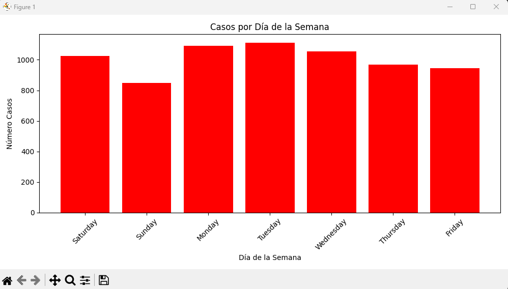

# Dashboard científico generado con Python y variables dinámicas

## Descripción

¡Bienvenido al **Dashboard Científico**! Este proyecto está diseñado para transformar datos crudos en información útil y visualmente atractiva. Partiendo de un fichero `.csv`, el Dashboard Científico extrae e interpreta una variedad de indicadores clave, tales como defunciones, casos nuevos, hospitalizaciones y pacientes en UCI. Mediante el uso de Python y técnicas de programación dinámica, el dashboard proporciona un análisis profundo y actualizable de los datos, facilitando la toma de decisiones informadas.

Con este proyecto, puedes visualizar datos mediante gráficos interactivos, incluyendo gráficos de queso (pastel) para representar la distribución de indicadores en diferentes provincias. El objetivo es ofrecer una herramienta poderosa y flexible para la gestión y visualización de datos científicos.

## Requisitos

- **Python**: 3.11.9 o superior
- **Dependencias**: `matplotlib`, entre otras.

## Instalación
Para comenzar a usar el Dashboard Científico, sigue estos pasos:

1. **Instala Python 3.11.9**: Asegúrate de tener Python 3.11.9 o una versión superior instalada en tu sistema. Puedes descargar la última versión de Python desde [python.org](https://www.python.org/downloads/).

2. **Clona el repositorio**:
   ```bash
   git clone https://github.com/usuario/dashboard-cientifico.git

## Capturas de Pantalla

A continuación, se muestra una captura del resultado final del Dashboard Científico en funcionamiento:


